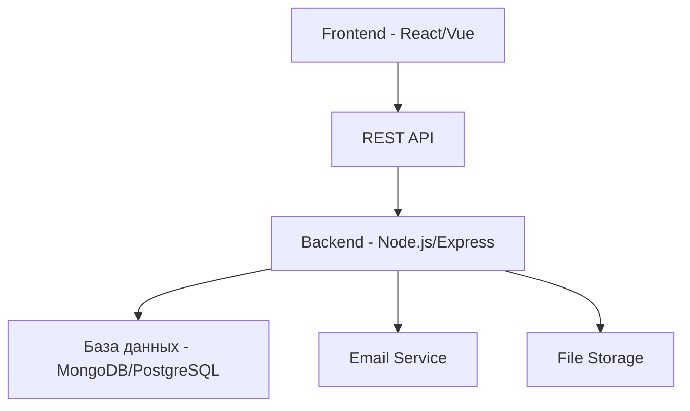

# Документ дизайна

## Обзор

Лендинг сайт медицинской организации будет реализован как современный одностраничный веб-сайт с адаптивным дизайном, точно соответствующий готовым макетам Figma. Сайт будет построен с использованием семантического HTML5, современного CSS3 и ванильного JavaScript для обеспечения быстрой загрузки и оптимальной производительности.

## Архитектура

### Общая архитектура системы
Система построена по принципу разделения фронтенда и бэкенда с REST API для взаимодействия между ними.



### Технологический стек

#### Frontend
- **Astro** - статический сайт генератор с островной архитектурой
- **React** - интерактивные компоненты (карусель, модальные окна, формы)
- **Vite** - быстрая сборка и hot reload
- **CSS Modules** - изолированные стили компонентов
- **Axios** - HTTP клиент для API запросов

#### Backend
- **Node.js** - серверная среда выполнения
- **Express.js** - веб-фреймворк для API
- **PostgreSQL** - реляционная база данных
- **Prisma** - современный ORM для TypeScript/JavaScript
- **Nodemailer** - отправка email уведомлений
- **Multer** - загрузка файлов
- **JWT** - аутентификация (для админ панели)

#### DevOps и инфраструктура
- **Docker** - контейнеризация приложения
- **Nginx** - веб-сервер и reverse proxy
- **PM2** - процесс-менеджер для Node.js
- **Git** - система контроля версий

### Структура проекта
```
medical-landing-site/
├── frontend/ (Astro + React)
│   ├── public/
│   │   ├── favicon.ico
│   │   ├── images/
│   │   └── icons/
│   ├── src/
│   │   ├── components/
│   │   │   ├── react/ (интерактивные React компоненты)
│   │   │   │   ├── Carousel.jsx
│   │   │   │   ├── Modal.jsx
│   │   │   │   ├── AppointmentForm.jsx
│   │   │   │   ├── ContactMap.jsx
│   │   │   │   └── admin/ (админ компоненты)
│   │   │   │       ├── LoginForm.jsx
│   │   │   │       ├── ContentEditor.jsx
│   │   │   │       ├── ServiceManager.jsx
│   │   │   │       ├── AdvantageManager.jsx
│   │   │   │       └── ImageUploader.jsx
│   │   │   └── astro/ (статические Astro компоненты)
│   │   │       ├── Header.astro
│   │   │       ├── Hero.astro
│   │   │       ├── Services.astro
│   │   │       ├── Advantages.astro
│   │   │       ├── Process.astro
│   │   │       ├── Contacts.astro
│   │   │       └── Footer.astro
│   │   ├── layouts/
│   │   │   ├── Layout.astro
│   │   │   └── AdminLayout.astro
│   │   ├── pages/
│   │   │   ├── index.astro
│   │   │   └── admin/
│   │   │       ├── index.astro
│   │   │       ├── login.astro
│   │   │       ├── content.astro
│   │   │       ├── services.astro
│   │   │       └── appointments.astro
│   │   ├── services/
│   │   │   └── api.js
│   │   ├── styles/
│   │   │   ├── global.css
│   │   │   ├── components/
│   │   │   └── admin.css
│   │   └── utils/
│   ├── astro.config.mjs
│   └── package.json
├── backend/
│   ├── prisma/
│   │   ├── schema.prisma
│   │   ├── migrations/
│   │   └── seed.js
│   ├── src/
│   │   ├── controllers/
│   │   │   ├── appointmentController.js
│   │   │   ├── serviceController.js
│   │   │   └── contactController.js
│   │   ├── routes/
│   │   │   ├── appointments.js
│   │   │   ├── services.js
│   │   │   └── contacts.js
│   │   ├── middleware/
│   │   │   ├── validation.js
│   │   │   └── errorHandler.js
│   │   ├── config/
│   │   │   └── database.js
│   │   ├── utils/
│   │   │   ├── emailService.js
│   │   │   └── prisma.js
│   │   └── app.js
│   ├── .env
│   ├── package.json
│   └── server.js
├── docker-compose.yml
└── README.md
```

## Компоненты и интерфейсы

### 1. Header Component (Astro)
**Назначение:** Статическая навигация и контактная информация
**Тип:** Astro компонент (статический)
**Структура:**
- Логотип медицинской организации (слева)
- Навигационное меню (центр): Главная, Услуги, Преимущества, Контакты
- Контактный телефон и кнопка "Записаться" (справа)
- Фиксированное позиционирование при прокрутке

### 2. Hero Section с каруселью (Astro + React)
**Назначение:** Первое впечатление и основная информация
**Тип:** Astro компонент с React островом для карусели
**Структура:**
- Заголовок H1 с названием организации (Astro)
- Подзаголовок с кратким описанием услуг (Astro)
- Карусель с 3-5 слайдами (React компонент с client:load)
- Основная CTA кнопка "Записаться на прием" (React с client:idle)

### 3. Advantages Section (Astro)
**Назначение:** Демонстрация ключевых преимуществ
**Тип:** Astro компонент (статический с CSS анимациями)
**Структура:**
- Заголовок секции H2
- Сетка из 4 карточек (2x2 на десктопе, 1x4 на мобильном)
- Каждая карточка: иконка, заголовок H3, описание
- CSS hover эффекты для интерактивности

### 4. Services Section (Astro + React)
**Назначение:** Презентация медицинских услуг
**Тип:** Astro компонент с React островом для фильтрации
**Структура:**
- Заголовок секции H2 (Astro)
- Табы или фильтры для категорий услуг (React с client:load)
- Сетка карточек услуг (3 колонки на десктопе)
- Каждая карточка: изображение, название, описание, кнопка "Подробнее"

### 5. Process Section (Astro)
**Назначение:** Объяснение процесса обследования
**Тип:** Astro компонент (статический)
**Структура:**
- Заголовок секции H2
- Пошаговая схема (горизонтальная на десктопе, вертикальная на мобильном)
- Нумерованные этапы с иконками и описаниями
- CSS анимации для визуальных соединителей

### 6. Contacts Section (Astro + React)
**Назначение:** Адреса клиник и контактная информация
**Тип:** Astro компонент с React островом для карты
**Структура:**
- Заголовок секции H2 (Astro)
- Двухколоночный макет: список адресов (Astro) + интерактивная карта (React)
- Карточки адресов с полной контактной информацией
- Интеграция с картами через React компонент (client:visible)

### 7. Footer Component (Astro)
**Назначение:** Дополнительная информация и ссылки
**Тип:** Astro компонент (статический)
**Структура:**
- Логотип и краткое описание организации
- Контактная информация и социальные сети
- Дополнительные ссылки (политика конфиденциальности, лицензии)
- Copyright информация

### 8. Modal Component (React)
**Назначение:** Форма записи пациентов
**Тип:** React компонент (client:idle)
**Структура:**
- Overlay с затемнением фона
- Центрированное модальное окно
- Форма с полями: ФИО, телефон, email, услуга, комментарий
- Кнопки "Отправить" и "Закрыть"
- Валидация полей и сообщения об ошибках
- Интеграция с API через Axios

### 9. Admin Panel (Astro + React)
**Назначение:** Простая админ панель для управления контентом сайта
**Тип:** Отдельные Astro страницы с React компонентами
**Структура:**
- Страница входа с аутентификацией (login/password)
- Dashboard с навигацией по разделам управления
- Редактор контента блоков (тексты, заголовки, изображения)
- CRUD интерфейс для услуг и категорий
- CRUD интерфейс для преимуществ и контактов
- Управление записями пациентов
- Загрузчик изображений с автоматической оптимизацией

## Модели данных

### Prisma схема базы данных

```prisma
// prisma/schema.prisma
generator client {
  provider = "prisma-client-js"
}

datasource db {
  provider = "postgresql"
  url      = env("DATABASE_URL")
}

model Appointment {
  id            Int      @id @default(autoincrement())
  fullName      String
  phone         String
  email         String
  serviceId     Int
  comment       String?
  preferredDate DateTime?
  status        AppointmentStatus @default(PENDING)
  createdAt     DateTime @default(now())
  updatedAt     DateTime @updatedAt
  
  service       Service  @relation(fields: [serviceId], references: [id])
  
  @@map("appointments")
}

model Service {
  id          Int      @id @default(autoincrement())
  name        String
  description String?
  categoryId  Int
  price       Decimal?
  duration    Int?     // в минутах
  image       String?
  isActive    Boolean  @default(true)
  createdAt   DateTime @default(now())
  updatedAt   DateTime @updatedAt
  
  category     ServiceCategory @relation(fields: [categoryId], references: [id])
  appointments Appointment[]
  
  @@map("services")
}

model ServiceCategory {
  id          Int      @id @default(autoincrement())
  name        String   @unique
  description String?
  order       Int      @default(0)
  isActive    Boolean  @default(true)
  createdAt   DateTime @default(now())
  updatedAt   DateTime @updatedAt
  
  services    Service[]
  
  @@map("service_categories")
}

model Contact {
  id           Int      @id @default(autoincrement())
  clinicName   String
  address      String
  phone        String
  email        String?
  workingHours String?
  latitude     Decimal?
  longitude    Decimal?
  isMain       Boolean  @default(false)
  isActive     Boolean  @default(true)
  createdAt    DateTime @default(now())
  updatedAt    DateTime @updatedAt
  
  @@map("contacts")
}

model Advantage {
  id          Int      @id @default(autoincrement())
  title       String
  description String?
  icon        String?
  order       Int      @default(0)
  isActive    Boolean  @default(true)
  createdAt   DateTime @default(now())
  updatedAt   DateTime @updatedAt
  
  @@map("advantages")
}

model Admin {
  id        Int      @id @default(autoincrement())
  username  String   @unique
  password  String   // хешированный пароль
  email     String?
  isActive  Boolean  @default(true)
  createdAt DateTime @default(now())
  updatedAt DateTime @updatedAt
  
  @@map("admins")
}

model ContentBlock {
  id        Int      @id @default(autoincrement())
  blockKey  String   @unique // hero_title, hero_subtitle, etc.
  content   String   // JSON строка с контентом
  createdAt DateTime @default(now())
  updatedAt DateTime @updatedAt
  
  @@map("content_blocks")
}

enum AppointmentStatus {
  PENDING
  CONFIRMED
  CANCELLED
}
```

### API Endpoints

#### Appointments API
- `POST /api/appointments` - создание новой записи
- `GET /api/appointments` - получение всех записей (админ)
- `GET /api/appointments/:id` - получение записи по ID
- `PUT /api/appointments/:id` - обновление статуса записи
- `DELETE /api/appointments/:id` - удаление записи

#### Services API
- `GET /api/services` - получение всех активных услуг
- `GET /api/services/categories` - получение категорий услуг
- `GET /api/services/category/:categoryId` - услуги по категории
- `POST /api/services` - создание услуги (админ)
- `PUT /api/services/:id` - обновление услуги (админ)
- `DELETE /api/services/:id` - удаление услуги (админ)

#### Contacts API
- `GET /api/contacts` - получение всех активных контактов
- `POST /api/contacts` - создание контакта (админ)
- `PUT /api/contacts/:id` - обновление контакта (админ)
- `DELETE /api/contacts/:id` - удаление контакта (админ)

#### Advantages API
- `GET /api/advantages` - получение всех активных преимуществ
- `POST /api/advantages` - создание преимущества (админ)
- `PUT /api/advantages/:id` - обновление преимущества (админ)
- `DELETE /api/advantages/:id` - удаление преимущества (админ)

#### Admin API
- `POST /api/auth/login` - аутентификация администратора
- `POST /api/auth/logout` - выход из системы
- `GET /api/auth/me` - проверка текущего пользователя
- `PUT /api/content/blocks/:blockId` - обновление контента блока
- `POST /api/upload/image` - загрузка и оптимизация изображений
- `GET /api/admin/dashboard` - статистика для админ панели

## Обработка ошибок

### Frontend обработка ошибок
- **Валидация форм:** проверка на клиенте перед отправкой
- **API ошибки:** обработка HTTP статусов (400, 401, 404, 500)
- **Сетевые ошибки:** fallback при отсутствии соединения
- **Loading states:** индикаторы загрузки для всех API запросов
- **Error boundaries:** React компоненты для перехвата ошибок

### Backend обработка ошибок
- **Валидация данных:** middleware для проверки входящих данных
- **Database ошибки:** обработка ошибок подключения и запросов
- **Authentication:** проверка JWT токенов для админ функций
- **Rate limiting:** защита от спама и DDoS атак
- **Logging:** запись ошибок в файлы/базу данных

### Безопасность
- **Input sanitization:** очистка пользовательского ввода
- **CORS:** настройка разрешенных доменов
- **Helmet.js:** установка security headers
- **Environment variables:** хранение секретных данных
- **SQL/NoSQL injection protection:** параметризованные запросы

### Мониторинг и логирование
- **Winston/Morgan:** логирование запросов и ошибок
- **Health check endpoints:** проверка состояния сервисов
- **Performance monitoring:** отслеживание времени ответа API
- **Error tracking:** интеграция с Sentry или аналогами

### Доступность
- **WCAG 2.1 AA compliance:** соответствие стандартам доступности
- **Screen reader support:** семантическая разметка
- **Keyboard navigation:** полная навигация с клавиатуры
- **Color contrast:** достаточный контраст для всех элементов
- **Focus management:** правильное управление фокусом в модальных окнах

## Стратегия тестирования

### Frontend тестирование
- **Unit тесты:** Vitest + React Testing Library для React компонентов
- **Astro тесты:** @astro/test для тестирования Astro компонентов
- **Integration тесты:** тестирование взаимодействия островов
- **E2E тесты:** Playwright для полных пользовательских сценариев
- **Visual regression:** скриншот тестирование для UI
- **Accessibility тесты:** axe-core для проверки доступности

### Backend тестирование
- **Unit тесты:** Jest для контроллеров и утилит
- **Integration тесты:** тестирование API endpoints с тестовой БД
- **Database тесты:** Prisma тестирование с PostgreSQL test database
- **Load тесты:** Artillery/k6 для нагрузочного тестирования
- **Security тесты:** проверка уязвимостей и валидации

### Производительность
- **Frontend:** Lighthouse аудит, Web Vitals мониторинг
- **Backend:** мониторинг времени ответа API
- **Database:** оптимизация запросов и индексов
- **CDN:** использование для статических ресурсов
- **Caching:** Redis для кеширования частых запросов

### DevOps и CI/CD
- **GitHub Actions:** автоматические тесты при push/PR
- **Docker:** контейнеризация Astro frontend и Node.js backend
- **Environment management:** dev/staging/production окружения
- **Prisma migrations:** автоматическое версионирование схемы БД
- **PostgreSQL backup:** регулярные бэкапы с pg_dump

### SEO и аналитика
- **Static Site Generation:** Astro генерирует статический HTML для отличного SEO
- **Meta теги:** динамические Open Graph и Twitter Cards через Astro
- **Structured data:** JSON-LD разметка для медицинских организаций
- **Google Analytics:** интеграция через Astro интеграцию
- **Sitemap:** автоматическая генерация через @astrojs/sitemap

### Мониторинг production
- **Uptime monitoring:** проверка доступности сайта
- **Error tracking:** Sentry для отслеживания ошибок
- **Performance monitoring:** New Relic/DataDog
- **Log aggregation:** ELK stack для централизованных логов
- **Alerts:** уведомления при критических ошибках